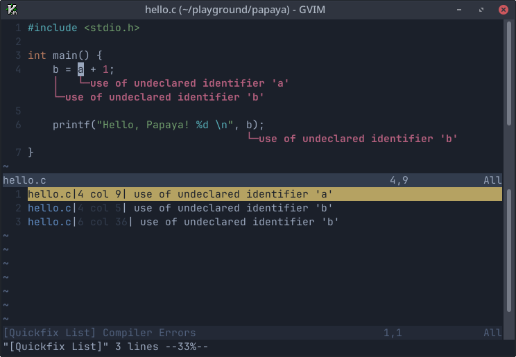

# Papaya
Alternative Vim compiler support



## Motivation

Papaya is a simple plugin to streamline running the C compiler from within Vim.

I found the native Vim compiler support too cumbersome for my needs so I decided to create a basic script. I also wanted to take advantage of Vim's newly introduced virtual text support.

## How it works
Papaya will use the value of your `makeprg` variable to run the compiler.
Alternatively, you can set the command using:

```vimscript
set g:papaya_make='command'
```

If there are compilation errors, Papaya will annotate the current buffer using virtual text (only works with Vim 9).

Papaya also populates the quick fix list.

## Commands

To run Papaya, use:
```
:PapayaMake
```
To see the original compilation output, use:

```
:PapayaOutput
```

To clear virtual text annotations, use:
```
:PapayaClear
```
